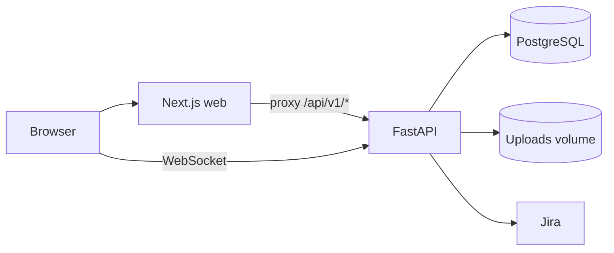

# Runtime diagram

```mermaid
flowchart LR
  B[Browser] --> W[Next.js web]
  W -->|proxy /api/v1/*| A[FastAPI]
  B -->|WebSocket| A
  A --> D[(PostgreSQL)]
  A --> U[(Uploads volume)]
  A --> J[Jira]
```
